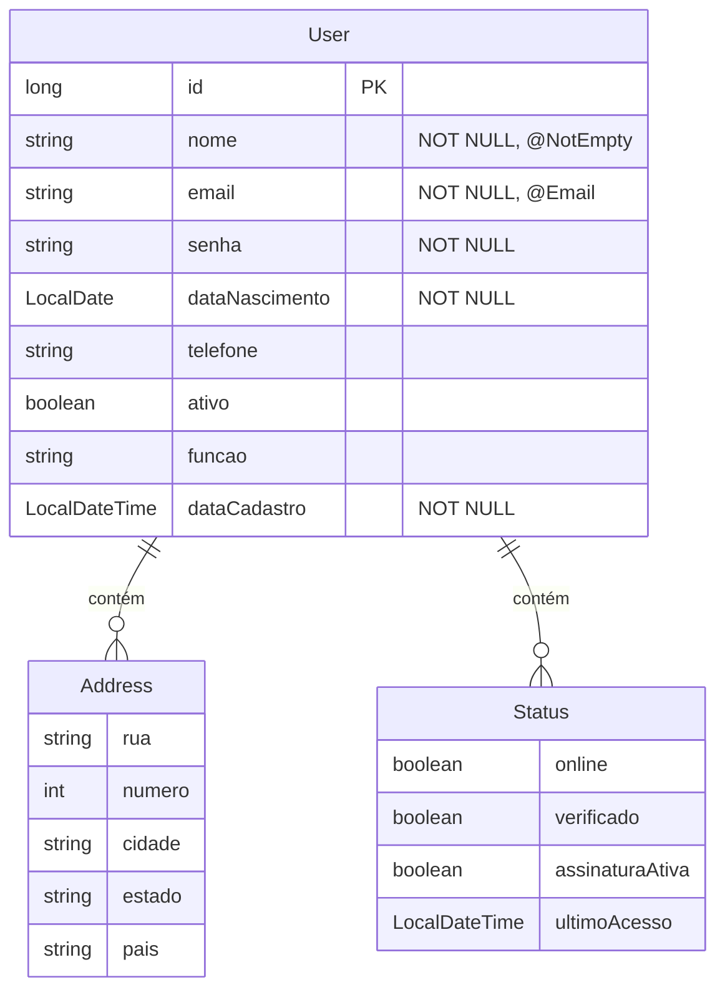

# 🚀 Users Filter Project - API (CRUD Completo)

[](https://www.java.com/)
[](https://spring.io/projects/spring-boot)
[](https://www.postgresql.org/)
[](https://github.com/BrunoLOSouza/Users_Filter_Project_CRUD)

Este é o Back-end da aplicação **Users Filter Project**, desenvolvido para fornecer um CRUD (Create, Read, Update, Delete) completo de gerenciamento de usuários. A API foi construída com Spring Boot 3, utilizando a nova especificação Jakarta EE, e é totalmente preparada para a nuvem com o banco de dados PostgreSQL.

---

## 🎯 Tecnologias Utilizadas

* **Linguagem:** Java 17
* **Framework:** Spring Boot 3.x
* **Banco de Dados:** PostgreSQL (Configurado para injeção automática de ambiente - Railway/Render)
* **Persistência:** Spring Data JPA / Hibernate
* **Auxiliares:** Lombok (Para getters/setters/construtores), Validation API (`jakarta.validation`)

---

## 🛠️ Entidades e Estrutura (Mermaid Diagram)

A arquitetura de dados segue o padrão de Entidade Principal (`User`) com objetos embutidos (`Address` e `Status`), simplificando a persistência com o `@Embedded` do JPA.


## ⚙️ Endpoints da API

A API está mapeada sob o prefixo base `/api/users`. Ela fornece um CRUD completo (Create, Read, Update, Delete) para o gerenciamento de usuários.

| Método | Endpoint | Descrição | Status de Sucesso |
| :--- | :--- | :--- | :--- |
| `POST` | `/api/users` | Cria um novo usuário no banco de dados. | `201 Created` |
| `GET` | `/api/users` | Lista todos os usuários cadastrados. | `200 OK` |
| `GET` | `/api/users/{id}` | Busca um usuário específico pelo ID. | `200 OK` ou `404 Not Found` |
| `PUT` | `/api/users/{id}` | Atualiza completamente um usuário existente. | `200 OK` ou `404 Not Found` |
| `DELETE` | `/api/users/{id}` | Exclui um usuário do banco de dados. | `204 No Content` |

### Tratamento de Exceções e Validação

A API utiliza um manipulador global de exceções (`ApplicationExceptionHandler`) para garantir que o Front-end receba respostas HTTP padronizadas para erros.

* **Validação de Dados:** Requisições `POST` e `PUT` com campos obrigatórios ausentes ou inválidos (ex: `@NotEmpty`, `@Email`) retornam `400 Bad Request`.
* **Formato do Erro:** O `ApplicationExceptionHandler` intercepta a exceção de validação (`MethodArgumentNotValidException`) e retorna um objeto JSON mapeando o campo e sua respectiva mensagem de erro.

---
---
## ☁️ Implantação e Conexão (Railway)

Este projeto está configurado para o ambiente de nuvem e utiliza o **PostgreSQL** como banco de dados persistente.

* **Dialeto Configurado:** `org.hibernate.dialect.PostgreSQLDialect`.
* **Estratégia JPA:** `spring.jpa.hibernate.ddl-auto=update` para criar as tabelas automaticamente na primeira execução.
* **Conexão:** As credenciais do banco de dados (URL, Username, Password) são injetadas automaticamente pelo Railway via Variáveis de Ambiente.

### Integração com o Front-end Angular (Netlify)

Após o *deploy* bem-sucedido no Railway, o Front-end (hospedado no Netlify, `projeto-bruno-blayker.netlify.app`) deve ser atualizado para chamar a URL pública da API no `user.service.ts`:

```typescript
// Exemplo de atualização no arquivo user.service.ts do Angular:
private apiUrl = '';
